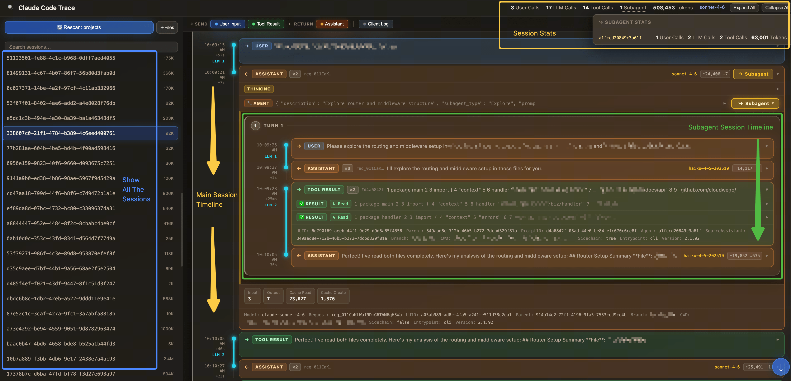

# Claude Code Trace

English | [中文](README_zh.md)

A **single-file, browser-only** local tool for visualizing Claude Code Agent session logs (`.jsonl`).

No installation or build step required. All parsing and rendering happen locally in the browser — your log data never leaves your machine.



---

## Features

### Timeline

Displays Agent messages as a chronological timeline, distinguishing between user input, Assistant responses, tool calls, and client logs. Each message can be expanded to inspect its `Thinking`, `Tool Call`, `Text`, and `Tool Result` blocks. Messages are grouped into `User Call`, `LLM Call`, and `Subagent Call` units, with per-call token usage shown inline.

### Subagent Drill-Down

At any tool call in the Main Session timeline, you can expand inline to view the full timeline of the corresponding Subagent Session.

### Stats Summary

The top bar aggregates key metrics for the current session — total messages, LLM call count, tool call count, number of subagents, total tokens, and models used — giving you a quick read on the scale and cost of an Agent run.

---

## Quick Start

1. Clone the repository:
   ```bash
   git clone https://github.com/hanfeihang/claude-code-trace.git
   ```
2. Open `claude-agent-trace.html` in Chrome, Arc, Edge, or Safari:
   ```bash
   cd claude-code-trace && open claude-agent-trace.html
   ```

---

## Use Cases

- Understand exactly what a Claude Code Agent did during a run: every LLM call's input and output, the Thinking process, tool call sequence, and returned results
- Debug slow or misbehaving sessions by tracing the Agent's decision path and identifying likely causes

---

## Technical Notes

- **Format**: Single static HTML file — no npm dependencies, no backend, works fully offline
- **Privacy**: All parsing and rendering happen in browser memory; log contents are never transmitted
